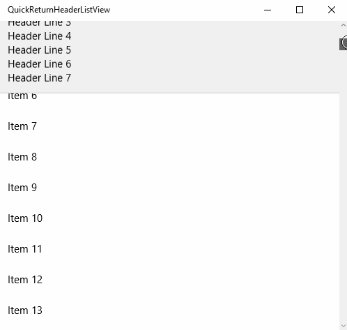

# QuickReturnHeader

## How to use

Add the QuickReturnHeader class and style to your project. Then define a regular ListView
and add a QuickReturnHeader to its header. Make sure to tell the header which
ListView it belongs to using the TargetListView property:

    <Page.Resources>
        <ResourceDictionary>
            <ResourceDictionary.MergedDictionaries>
                <ResourceDictionary Source="ms-appx:///QuickReturnHeader.xaml" />
            </ResourceDictionary.MergedDictionaries>
        </ResourceDictionary>
    </Page.Resources>

    <ListView x:Name="MyList">
        <ListView.Header>
            <local:QuickReturnHeader TargetListView="{x:Bind MyList}">
				<TextBlock Text="Header" />
            </local:QuickReturnHeader>
        </ListView.Header>
    </ListView>
